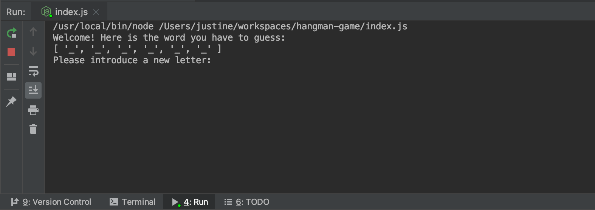
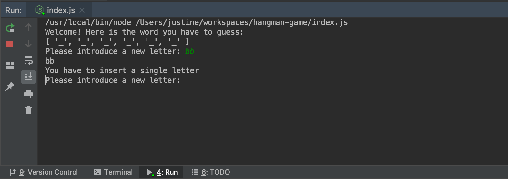
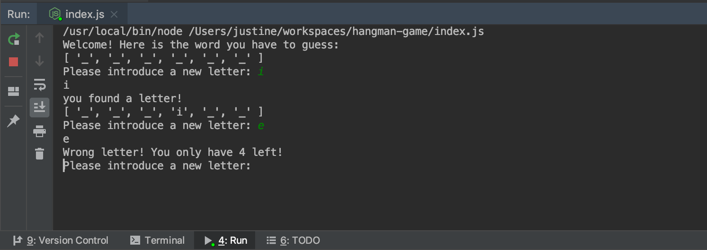
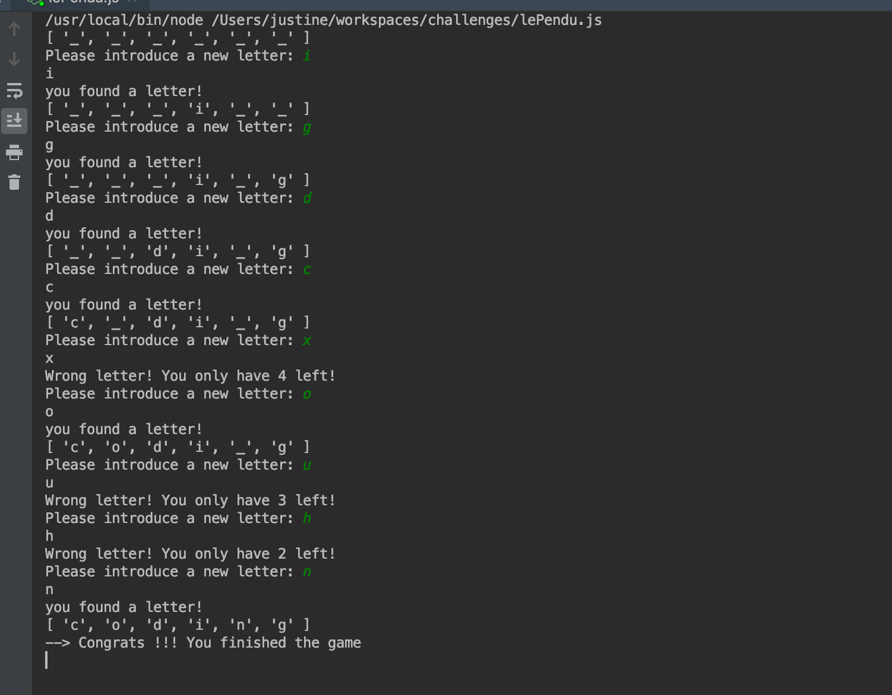
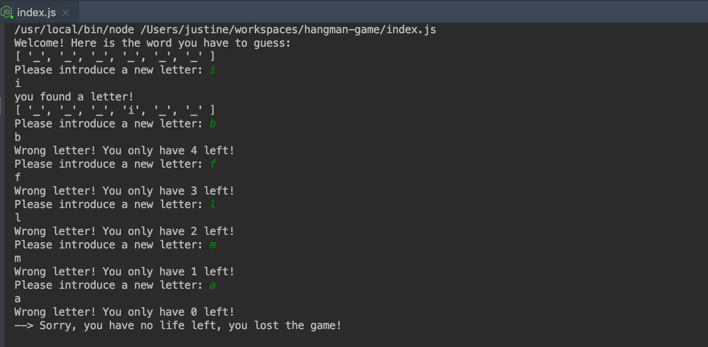

# hangman-game
- Command line game based on the famous game 'Hangman'

- Technologies: Javascript

### Games screenshots 

- Example // Starting the game: 

- Example // User input errors (insert two letters instead of one):

- Example // Inserting a wrong letter:  

- Example // Winning the game: 

- Example // Losing the game:

#### Thank you for reading!

Justine.